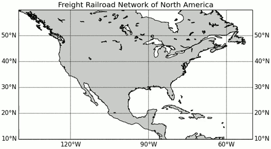
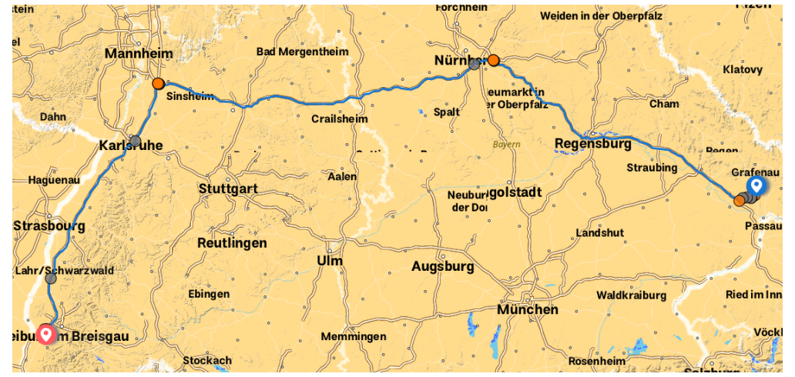
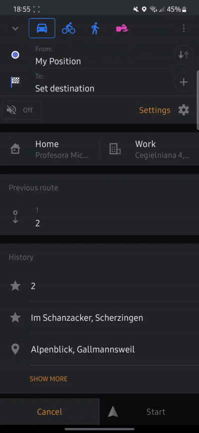
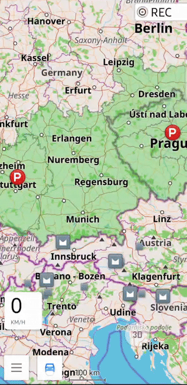

import Tabs from '@theme/Tabs';
import TabItem from '@theme/TabItem';
import AndroidStore from '@site/src/components/buttons/AndroidStore.mdx';
import AppleStore from '@site/src/components/buttons/AppleStore.mdx';
import LinksTelegram from '@site/src/components/_linksTelegram.mdx';
import LinksSocial from '@site/src/components/_linksSocialNetworks.mdx';
import Translate from '@site/src/components/Translate.js';
import InfoIncompleteArticle from '@site/src/components/_infoIncompleteArticle.mdx';
import ProFeature from '@site/src/components/buttons/ProFeature.mdx';
import InfoAndroidOnly from '@site/src/components/_infoAndroidOnly.mdx';

In our increasingly connected world, reliable and efficient navigation is crucial, especially when traveling in areas without stable internet coverage. Many users face common frustrations with offline navigation, such as slow route calculations, excessive battery usage, and overly complicated routes. Recognizing these challenges, OsmAnd has developed a solution designed specifically to improve offline routing performance. **Highway Hierarchy (HH) Routing** is a fast and smart approach that prioritizes major roads and reduces calculation time.  

In this article, we will explore what HH Routing is, how it works, its technical implementation in OsmAnd, and why it represents a major improvement over traditional routing methods. Let’s dive in and see how HH Routing can transform your offline navigation experience.

<!--truncate-->

## What is Highway Hierarchy (HH) Routing

The [HH routing algorithm](https://en.wikipedia.org/wiki/Road_hierarchy) is a method that streamlines route calculations by organizing roads into a hierarchy based on their significance. **Primary and arterial roads are prioritized over local streets**, allowing the algorithm to calculate routes more efficiently by focusing on the most critical segments of the network.  

This hierarchical approach reduces the complexity of the calculations, resulting in faster route planning. This is particularly beneficial for offline navigation where processing resources are limited.

## Implementation of HH Routing

OsmAnd has integrated HH routing into its offline navigation system to enhance performance. Each month, the OsmAnd team generates specialized routing data for car, cycling, and pedestrian navigation, typically available by the 5th of the month. This data is then incorporated into the offline OBF maps. You can access these updates by refreshing maps.

A critical component of this system is the use of checkpoints. These are **strategically selected locations on the map, such as city exits or primary intersections**, that serve as *key nodes* in the routing process. The HH algorithm simplifies the pathfinding process by calculating routes from one control point to another, enabling fast route determination.

## Technical Aspects of HH Routing

To understand the efficiency of Highway Hierarchies (HH) routing in OsmAnd, it is essential to compare it with other routing algorithms and examine its implementation, data processing methods, and performance optimizations.

### How OsmAnd Implements HH Routing  

- OsmAnd pre-calculates routing data, allowing it to function entirely offline without requiring an internet connection.

- Instead of evaluating all possible paths, HH routing calculates routes checkpoint-to-checkpoint (e.g., major intersections, highway exits, and city boundaries).

- OsmAnd updates the routing data at the beginning of each month, ensuring that the latest road network changes are reflected.

**Checkpoint-based routing process:**

- **Starting** point selection - the algorithm finds the closest checkpoint to the user’s location.
- Path calculation **between checkpoints** - instead of scanning the entire road network, OsmAnd prioritizes predefined road segments to connect these key points.
- **Final destination** - the last section of the route is refined to reach the exact destination efficiently.

### How HH Routing differs from Graph-Based Routing

**Traditional Graph-Based Routing (A*, Dijkstra's Algorithm, etc.)**

Graph-based routing treats every road segment equally, performing exhaustive searches to find the shortest path. This approach is highly accurate but requires significant processing power. [OsmAnd still supports graph-based routing options](https://osmand.net/docs/user/navigation/guidance/navigation-settings#development-settings), such as:

- **A* 2-phase**. A heuristic-based pathfinding algorithm that improves standard A* search.
- **A* Classic**. Incorporates hierarchical data to enhance efficiency.

These algorithms work well for small-scale maps but become increasingly slow when handling large geographical areas.

|[A* Classic](https://en.wikipedia.org/wiki/A*_search_algorithm) is searching for a path between Washington, D.C., and Los Angeles.|
|:---|
||

**Highway Hierarchies (HH) Routing.**  

HH routing overcomes the limitations of graph-based methods by pre-calculating a hierarchical structure of the road network, allowing for rapid pathfinding.

**Key Differences:**

| Feature | Graph-Based Routing (A*) | HH Routing|  
|---------|--------------------------|----------------------|  
| **Calculation approach** | Scans all possible paths | Uses predefined road hierarchy |
| **Performance** | Slower for large distances | Optimized for long routes |
| **Offline efficiency** | Requires heavy processing | Pre-calculated, lightweight |
| **Use case** | Best for short-distance, urban trips | Ideal for long-distance and offline use |

### Variants of HH Routing

OsmAnd provides [several implementations of HH routing](https://osmand.net/docs/user/navigation/guidance/navigation-settings#development-settings), each optimized for different device performance levels and navigation needs:

- **HH (Highway Hierarchies) x Java**. Java-based implementation of Highway Hierarchies routing, offering good efficiency but higher memory consumption.
- **HH (Highway Hierarchies) x C++**. A performance-optimized variant that reduces RAM usage and significantly speeds up route calculations, particularly useful for larger maps and complex routes.

**Why use C++-based HH routing?**

- Reduced RAM usage compared to Java-based routing.
- More efficient at handling highly detailed offline maps.
- Optimized for cross-country and large-scale route calculations.

*For the best performance, OsmAnd recommends using HH x C++ routing when available.*

## Advantages of HH Routing

The implementation of HH routing in OsmAnd offers several notable benefits:

- **Speed**. The algorithm reduces route calculation time by focusing on primary roads and using checkpoints, providing fast navigation guidance.

- **Accuracy**. The hierarchical structure ensures that the most appropriate and practical routes are selected, enhancing the overall navigation accuracy.

- **Resource optimization**. HH routing minimizes the computational load on devices, which is particularly advantageous for offline scenarios where processing power and storage may be constrained.

In contrast to traditional graph routing methods that evaluate numerous possible paths, HH routing streamlines the process by concentrating on essential routes.

## Update Maps for Optimal HH Routing

To take full advantage of HH routing, it is important to keep your offline maps up to date. OsmAnd releases updated routing data at the beginning of each month.

- To [update your maps](https://osmand.net/docs/user/personal/maps-resources#updates), go to *Menu → Maps & Resources → Updates*.
- To [select routing type](https://osmand.net/docs/user/navigation/guidance/navigation-settings#development-settings), go to *Menu → Settings → app profile → Navigation settings → Route parameters → Development → Routing type (Android) / Routing algorithm (iOS)*

## Example

To better understand the efficiency of **HH x C++ Fast Routing** compared to **Traditional A* 2-phase Routing**, let’s experiment using the same route across both profiles.

***Test route:***

- **Start:** [48.73829, 13.41383](https://osmand.net/map/?pin=48.738262,13.413754#18/48.73823/13.41362)
- **Finish:** [47.94505, 7.73573](https://osmand.net/map/?pin=47.945066,7.735711#19/47.94500/7.73592)
- **OsmAnd Web Preview:** [View Route](https://osmand.net/map/navigate/?start=48.738290,13.413830&end=47.945050,7.735730&profile=car#7/48.611/11.530)

| [HH x C++ Fast Routing](https://osmand.net/docs/user/navigation/guidance/navigation-settings#development-settings) | [Traditional Routing A*2-phase](https://osmand.net/docs/user/navigation/guidance/navigation-settings#development-settings)  |
|------------|----------------------|
| Calculation time: **13 sec**| Calculation time: **36 sec** |
|  |  |

***Baltimore to Atlanta***:

- **Start:** [39.296098, -76.602457](https://osmand.net/map/?pin=48.738262,13.413754#18/48.73823/13.41362)
- **Finish:** [33.751570, -84.410984](https://osmand.net/map/?pin=47.945066,7.735711#19/47.94500/7.73592)
- **OsmAnd Web Preview:** [View Route](https://osmand.net/map/navigate/?start=39.296098,-76.602457&end=33.751570,-84.410984&profile=car#7/36.695/-82.227)

| [HH x C++ Fast Routing](https://osmand.net/docs/user/navigation/guidance/navigation-settings#development-settings) | [Traditional Routing A*2-phase](https://osmand.net/docs/user/navigation/guidance/navigation-settings#development-settings)  |
|------------|----------------------|
| Calculation time: **29 sec**| Calculation time: **180 sec** |
|  |  |

***Praha to Stuttgart***:

- **Start:** [50.099568, 14.400652](https://osmand.net/map/?pin=48.738262,13.413754#18/48.73823/13.41362)
- **Finish:** [48.806807, 9.231252](https://osmand.net/map/?pin=47.945066,7.735711#19/47.94500/7.73592)
- **OsmAnd Web Preview:** [View Route](https://osmand.net/map/navigate/?start=50.099570,14.400650&end=48.806810,9.231250&profile=car#8/49.490/10.857)

| [HH x C++ Fast Routing](https://osmand.net/docs/user/navigation/guidance/navigation-settings#development-settings) | [Traditional Routing A*2-phase](https://osmand.net/docs/user/navigation/guidance/navigation-settings#development-settings)  |
|------------|----------------------|
| Calculation time: **15 sec**| Calculation time: **53 sec** |
|  |  |

***Baltimore to Atlanta***:

- **Start:** [39.296098, -76.602457](https://osmand.net/map/?pin=48.738262,13.413754#18/48.73823/13.41362)
- **Finish:** [33.751570, -84.410984](https://osmand.net/map/?pin=47.945066,7.735711#19/47.94500/7.73592)
- **OsmAnd Web Preview:** [View Route](https://osmand.net/map/navigate/?start=39.296098,-76.602457&end=33.751570,-84.410984&profile=car#7/36.695/-82.227)

|[HH x C++ Fast Routing](https://osmand.net/docs/user/navigation/guidance/navigation-settings#development-settings) |
|:------------|
| Calculation time: **29 sec**|
| <iframe width="320" height="569" src="https://www.youtube.com/embed/xIFq9DtceaM" title="HH routing example: Baltimore to Atlanta" frameborder="0" allow="accelerometer; autoplay; clipboard-write; encrypted-media; gyroscope; picture-in-picture; web-share" referrerpolicy="strict-origin-when-cross-origin" allowfullscreen></iframe> |
|[**Traditional Routing A*2-phase**](https://osmand.net/docs/user/navigation/guidance/navigation-settings#development-settings)  |
|Calculation time: **180 sec** |
|<iframe width="507" height="569" src="https://www.youtube.com/embed/J7kjeCbQef8" title="A2 routing example: Baltimore to Atlanta" frameborder="0" allow="accelerometer; autoplay; clipboard-write; encrypted-media; gyroscope; picture-in-picture; web-share" referrerpolicy="strict-origin-when-cross-origin" allowfullscreen></iframe>|

***Praha to Stuttgart***:

- **Start:** [50.099568, 14.400652](https://osmand.net/map/?pin=48.738262,13.413754#18/48.73823/13.41362)
- **Finish:** [48.806807, 9.231252](https://osmand.net/map/?pin=47.945066,7.735711#19/47.94500/7.73592)
- **OsmAnd Web Preview:** [View Route](https://osmand.net/map/navigate/?start=50.099570,14.400650&end=48.806810,9.231250&profile=car#8/49.490/10.857)

| [HH x C++ Fast Routing](https://osmand.net/docs/user/navigation/guidance/navigation-settings#development-settings) |
|:------------|
| Calculation time: **15 sec**|
|<iframe width="320" height="569" src="https://www.youtube.com/embed/r2rDHcO_4yE" title="HH routing example: Praha to Stuttgart" frameborder="0" allow="accelerometer; autoplay; clipboard-write; encrypted-media; gyroscope; picture-in-picture; web-share" referrerpolicy="strict-origin-when-cross-origin" allowfullscreen></iframe> |
|[**Traditional Routing A*2-phase**](https://osmand.net/docs/user/navigation/guidance/navigation-settings#development-settings)  |
|Calculation time: **53 sec** |
| <iframe width="320" height="569" src="https://www.youtube.com/embed/0BzE8tkC5ek" title="A2 routing example: Praha to Stuttgart" frameborder="0" allow="accelerometer; autoplay; clipboard-write; encrypted-media; gyroscope; picture-in-picture; web-share" referrerpolicy="strict-origin-when-cross-origin" allowfullscreen></iframe> |

***Key takeaways:***

- **HH x C++ Fast Routing** significantly **reduces calculation time** compared to traditional A* 2-phase routing.
- **More efficient route calculation** enables a faster and smoother navigation, especially when dealing with long-distance routes.
- **Recommended for users** who prioritize speed in offline routing scenarios.

*For optimal performance, always **update your offline maps** to ensure the most efficient route calculations.*

## Conclusion

OsmAnd's integration of the Highway Hierarchies routing algorithm marks a significant advancement in offline navigation. By prioritizing primary roads and using checkpoints, HH routing offers you faster and more accurate route calculations. To experience these benefits fully, you are encouraged to update their maps regularly and engage with the OsmAnd community for feedback and support.

 

_________________

 

Please feel free to contact us. We appreciate and welcome every contribution you make to the further development of OsmAnd.

- **Follow**: <LinksSocial/>  

- **Join**: <LinksTelegram/>  

- **Get**: &nbsp;<AndroidStore/>  

    <AppleStore/>
