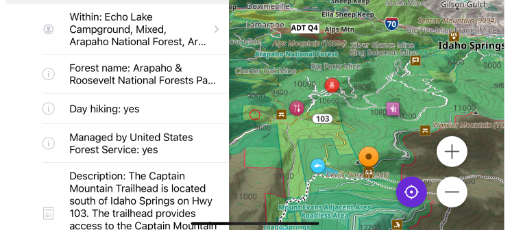
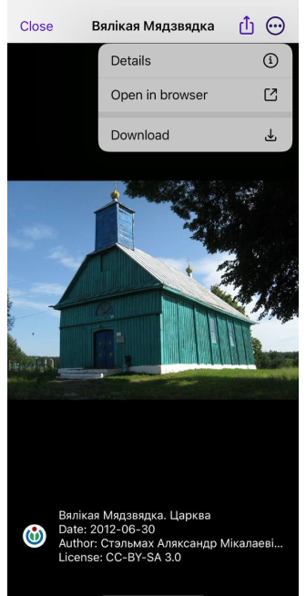
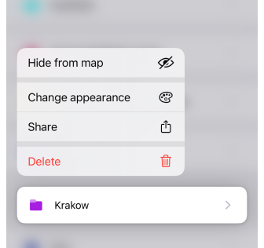
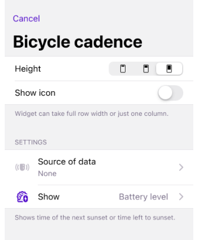
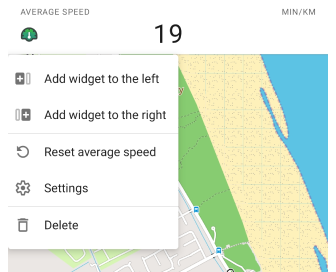
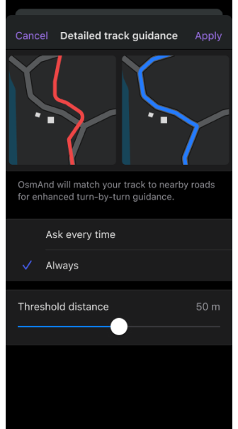
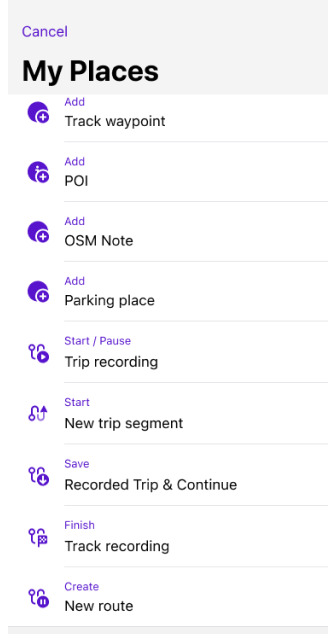
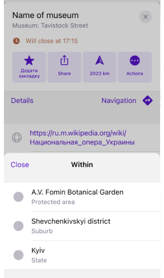
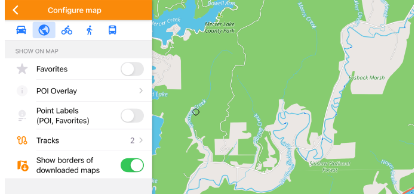

import Tabs from '@theme/Tabs';
import TabItem from '@theme/TabItem';
import AndroidStore from '@site/src/components/buttons/AndroidStore.mdx';
import AppleStore from '@site/src/components/buttons/AppleStore.mdx';
import LinksTelegram from '@site/src/components/_linksTelegram.mdx';
import LinksSocial from '@site/src/components/_linksSocialNetworks.mdx';
import Translate from '@site/src/components/Translate.js';
import InfoIncompleteArticle from '@site/src/components/_infoIncompleteArticle.mdx';
import ProFeature from '@site/src/components/buttons/ProFeature.mdx';

# iOS 5.0

## Join Beta

iOS beta builds (TestFlight) are usually provided weekly (after a Team Sprint demo). They do not contain descriptions and may have continuous versioning. They are assumed to be stable and ready to use.  

  <a class="button button--active" href="https://testflight.apple.com/join/7poGNCKy">Join TestFlight</a>

 

## What's new

- [Introduced Smart Folders](#smart-folders-for-automatic-track-organization) for automatic track organization.
- [Redesigned the image block](#redesign-image-block-in-context-menu) in context menu.
- [Added a full-screen gallery](#gallery-viewer-for-wikimedia-images) for viewing Wikimedia images.
- [Added option to toggle](#toggle-visibility-for-favorite-groups) the visibility of individual favorite groups on the map.
- [Flexible appearance](#flexible-appearance-settings-for-favorite-groups) settings for favorite groups.
- [Expanded icon selection](#expanded-icon-options-for-favorites) options for favorites by adding all existing icons from all POI categories.
- [Added option to change the appearance](#change-appearance-for-multiple-tracks) of multiple tracks simultaneously.
- [Battery level](#battery-status-for-external-sensors) display for external sensors.
- [Added a *Reset* action](#reset-option-for-the-average-speed-widget) for the Average Speed widget.
- [*Detailed track guidance* option and an *Attach to the roads*](#detailed-track-guidance-and-attach-to-the-roads) suggestion dialog has been added.
- [Prominent peaks](#prominent-peaks-now-discoverable) are now discoverable on the map and in search.
- [Added Quick Actions](#quick-actions-for-trip-recording) to manage trip recording.
- [CarPlay address search](#improved-carplay-address-search-prioritization) has prioritized streets and buildings.
- [Discover nearby areas](#polygon-selection-for-nearby-areas) with OsmAnd polygon info.
- [Closing Configure Map](#closing-configure-map-after-tapping-the-map) menu after tapping the map.

- [Optional updates](#optional-updates). Additional updates and refinements for the release.

<!--
To docs ios:  

- Expanded icon options for Favorites by adding icons from all POI categories - https://github.com/osmandapp/OsmAnd-iOS/issues/3942  
- CarPlay Search: Added the ability to select buildings. - https://github.com/osmandapp/OsmAnd-iOS/issues/3959   
- Added an option to change the appearance of multiple tracks simultaneously. - https://github.com/osmandapp/OsmAnd-iOS/issues/3687  
- Added battery level display for external sensors. - https://github.com/osmandapp/OsmAnd-iOS/issues/3953   / https://github.com/osmandapp/OsmAnd-iOS/issues/4145  
- Added border highlighting fro buildings and ares with detailed information. - https://github.com/osmandapp/OsmAnd-iOS/issues/4164
- Added Quick Actions for controlling trip recording. - https://github.com/osmandapp/OsmAnd-iOS/issues/4176
- Redesigned image block and separate screen for all images. - https://github.com/osmandapp/OsmAnd-iOS/issues/4062
- Added a full-screen gallery viewer for Wikimedia images - https://github.com/osmandapp/OsmAnd-iOS/issues/4062  

add to docs android:

- redesign of the widget configuration screen — https://github.com/osmandapp/OsmAnd-Issues/issues/2525
- Discover top-ranked POIs with the new Explore mode (Photos oh the map) — https://github.com/osmandapp/OsmAnd-Issues/issues/2662
- Wikidata in map data (wikipedia maps) #2921 - https://github.com/osmandapp/OsmAnd-Issues/issues/2921

-->

## Smart Folders for Automatic Track Organization

**Smart Folders** for tracks are now available, enhancing the way you organize your saved locations. This feature, previously available on Android, is designed to help you manage and automatically sort your tracks into folders based on predefined criteria.

Key features:

- **Automatic organization** - Smart Folders automatically sort tracks into categories such as *date*, *location*, *speed*, and more.
- **Customizable sorting** - You can define how tracks are grouped using filters, making it easier to manage and find specific tracks.
- **Improved track management** - With Smart Folders, you can quickly organize and access your tracks, making your trip planning and navigation more efficient.

How to use:  
Go to *Menu → My Places → Tracks* and select *Add smart folder* to start organizing your tracks automatically.  

Learn more:  
[Smart Folder Setup for Tracks](https://osmand.net/docs/user/personal/tracks/smart-folder)

## Redesign Image Block in Context Menu

The **image block** in the context menu has been redesigned for a more streamlined experience. Now, **Online Photos** (Wikimedia images) and **Street-level Imagery** (Mapillary images) are displayed as separate items within the menu.

Key improvements:

- **Separate sections** for Online Photos and Street-level Imagery.
- **Gallery view** — Tapping on an image opens it in full-screen mode.
- **Explore button** for Street-level Imagery — Opens Mapillary view for detailed street-level imagery.
- **View all button** — A new button under photos allows users to access a **separate screen** listing all images related to the location.

How to use:  
Tap on a location to open the context menu, then select **Online Photos** or **Street-level Imagery** to view images.  

Learn more:  
[Online Photos in Map Context Menu](https://osmand.net/docs/user/map/map-context-menu#online-photos)  

## Gallery Viewer for Wikimedia Images

Introducing an enhanced **gallery viewer** for **Wikimedia images**, allowing for a more immersive photo viewing experience for points of interest.

Key features:

- **Context menu integration** — Tap a POI on the map to open its context menu and access associated *Wikimedia images*.
- **Gallery viewer** — Browse multiple images in sequence with the updated gallery layout
- **Full-screen option** — View images in full-screen mode for better clarity and detail.
- **Image details** — For each image, you can view key metadata such as description, date, author, and license.

How to use:  
Tap a **POI** on the map with **Wikimedia images** available, then select the **View all** option from the context menu to explore images.  

Learn more:  
[Map Context menu](https://osmand.net/docs/user/map/map-context-menu#online-photos).

## Toggle Visibility for Favorite Groups

OsmAnd 5.0 introduces an updated **visibility toggle** for favorite groups, providing more control over what is displayed on the map. This feature, previously available on Android, is now also part of the iOS version.

Key improvements:

- **Hide or show favorite groups** — Easily turn off visibility of specific group of favorites.
- **Organize favorites** — Helps declutter the map by controlling which groups are visible at any given time.
- **Improved organization** — Hidden groups are moved to the bottom of the list for better management.

How to use:  
Go to *Menu → My Places → Favorites → long tap folder → Show on map option*.

Learn more:  
[Favorites Management](https://osmand.net/docs/user/personal/favorites#favorite-group-actions)

## Flexible Appearance Settings for Favorite Groups

In this release, you can **separately customize** the *icon, color*, and *shape* for each group of favorites without resetting all attributes. And then override the settings for existing points in the folder, only new favorites, or apply to all. This allows you to visually organize your saved locations more precisely.  

Learn more:  
[Change Group Appearance](https://osmand.net/docs/user/personal/favorites/#change-group-appearance)

## Expanded Icon Options for Favorites

In OsmAnd 5.0 for iOS, you can choose icons from all **POI categories** for your **Favorites**. The added full icon library allows you to search and select icons using the **Сustom POI search**, making it easier to organize and personalize your saved locations.

Key features:

- **Choose from all POI icons** — Select from a wide range of icons available in all **POI categories** to identify specific places on the map.
- **Search for icons** - Quickly find the perfect icon for your Favorites using the **Custom POI Search** feature.

Learn more:  
[Customize Favorites](https://osmand.net/docs/user/personal/favorites/#favorite-icons)

## Change Appearance for Multiple Tracks

You can now **change the appearance** of **multiple tracks** simultaneously through a new setting in *Selection mode*. This update makes it easier to apply consistent settings across multiple tracks, helping you quickly modify their appearance for better visualization.

Parameters you can modify for all selected tracks:

- **Direction arrows** — Add direction arrows.
- **Start / Finish icons** — Display start and finish icons.
- **Coloring** — Change the color scheme.
- **Width** — Adjust the line width.
- **Split interval** — Modify the split interval.

Learn more:  
[Track Appearance Settings](https://osmand.net/docs/user/map/tracks/appearance)

## Battery Status for External Sensors

In OsmAnd 5.0, you can now **view the battery level** of connected external sensors as a main value. This makes it easier to monitor their status and ensures optimal performance during use.

Key features:

- **Battery level display** — Check the **battery level** of all connected external sensors directly in the app.
- **Real-time monitoring** — The battery status updates in real time, helping you manage sensor power effectively.

How to use:

- Go to *Menu → Plugins → External Sensors* to view connected sensors and their battery status.
- Go to *Menu → Configure screen → Choose a panel → Add widget → External Sensors → Choose sensor → Settings → Show → Battery level*.
- Long tap the widget on the map screen and select *Settings*.

Learn more:  
[External Sensors plugin](https://osmand.net/docs/user/plugins/external-sensors)

## Reset Option for the Average Speed Widget

You can now **reset the average speed** directly from the *widget’s context menu*. This update adds a **Reset** action, allowing you to start fresh measurements without restarting navigation.  

What’s new:

- **Context menu option** to reset average speed via *long tap* on the widget on the map screen.  
- **Reset action added to the widget settings** in the *Configure Screen* menu for quick access.  

Learn more:  
[Average Speed Widget](https://osmand.net/docs/user/widgets/info-widgets/#average-speed)
[Configure Screen](https://osmand.net/docs/user/widgets/configure-screen#widget-settings)

## Detailed Track Guidance and Attach to the Roads

OsmAnd 5.0 for iOS introduces **Detailed Track Guidance** with the ability to **automatically attach tracks to roads**, enhancing your navigation experience.  

Key features:

- **Attach to the roads** — When using a track as your destination, OsmAnd can automatically align the track with the nearest roads for more accurate navigation. This feature is available in the **Follow track** menu.

- **Automatic or manual confirmation**:
  - **Ask every time** (default) — The *Attach to the roads* feature appears in the **Route Details** section each time a track-based route is calculated, letting you decide whether to apply road attachment for each session.
  - **Always apply** — This option automatically attaches the track to the roads for every **navigation by track** route, with no manual confirmation needed.

How to use:  
Go to *Menu → Settings → App profiles → Navigation settings → Detailed track guidance*.

Learn more:  
[Detailed Track Guidance](https://osmand.net/docs/user/navigation/setup/gpx-navigation#detailed-track-guidance)  
[Attach to the Roads](https://osmand.net/docs/user/navigation/setup/gpx-navigation#attach-to-the-roads)

## Prominent Peaks Now Discoverable  

Now you can **discover prominent peaks** directly on the map and through search. This update adds [notable mountain peaks](https://en.wikipedia.org/wiki/Ultra-prominent_peak) to the basemap, allowing you to easily find their names, elevations, and additional details through the map's context menu or search functionality.

Simply tap on the *peak icons* on the map, or use the *Search → Mountain Peaks* to quickly locate and explore key mountain summits.

Learn more:  
[Map Context Menu](https://osmand.net/docs/user/map/map-context-menu)

## Quick Actions for Trip Recording

This release introduces **quick actions** for **trip recording**, allowing you to manage your journey recording with just a tap, improving efficiency and safety while on the go.

Key features:

- **Convenient access** — Start, pause, save and finish a recording trip with new quick action buttons.
- **Quick control** — Use the *quick action buttons* to easily manage your trip recording without navigating through multiple screens.

How to use:  
Go to *Menu → Configure screen → Custom buttons → Quick action → Add action → My Places* to add one or more actions to your screen.

Learn more:  
[Quick Actions for My Places](https://osmand.net/docs/user/widgets/quick-action#my-places)

## Improved CarPlay Address Search Prioritization

.png)

The **CarPlay Search** feature now prioritizes streets and building numbers when searching for addresses, improving navigation.

Key features:

- **Streets and buildings first** - Streets and building numbers appear first when searching for an address. This ensures that relevant address details are displayed before other locations such as roads or stations.
- **Search flow by city and street** — When searching for a city, streets within the city show first, followed by building numbers for those streets.
- **Optimized for navigation** - This change improves the navigation process by prioritizing address-related information.

Learn more:  
[CarPlay Search](https://osmand.net/docs/user/navigation/car-play#search)  
[Address Search Guide](https://osmand.net/docs/user/search/search-address)

## Polygon Selection for Nearby Areas

The **Polygon Information** feature has been enhanced in OsmAnd for iOS, providing easier access to data about surrounding areas directly from the map.  

Now, with a **long tap** the map or a **single tap** a POI, you can access detailed information about nearby polygons. This feature makes it quick and convenient to identify geographic or administrative areas around you.  

What’s new:

- **View polygon details** — Easily access information about nearby areas from the map context menu, including their *type* and *name*.  
- **Sorted by size** — Polygons are sorted by *size* from *smallest to largest* for better organization.

To access:  
*Map Context menu → Details → Within*.

Learn more:  
[Map Context menu - polygon information](https://osmand.net/docs/user/map/map-context-menu#polygon-information)

## Closing Configure Map after Tapping the Map

You can now **automatically close the *Configure Map* menu** by tapping the visible part of the map. This enhancement makes interacting with OsmAnd even more convenient.

Key features:

- **Automatic close** — After selecting options in the *Configure Map* menu, a simple tap the map closes the menu, reducing the number of steps required to resume map interaction.
- **Improved usability** — This feature allows for a smoother and more intuitive workflow when configuring map settings.

How to use:  
Simply tap anywhere on the map after configuring the settings in the **Configure Map** menu to close it.

Learn more:  
[Configure Map Menu](https://osmand.net/docs/user/map/configure-map-menu)

## Optional updates

- Added support for [Vietnamese and Hebrew](https://osmand.net/docs/user/navigation/guidance/voice-navigation#voice-prompt-language) Text-to-Speech (TTS) for navigation.
- Added [border highlighting for buildings](https://github.com/osmandapp/OsmAnd-iOS/issues/4164) and ares with detailed information.
- [Custom button: Show/hide MTB routes](https://github.com/osmandapp/OsmAnd-iOS/issues/4393) defaults to IMBA trail.
- Fixed issues:  
  - The [UTM coordinate input sequence](https://github.com/osmandapp/OsmAnd-iOS/issues/4333).
  - An issue with [track waypoint colors](https://github.com/osmandapp/OsmAnd-iOS/issues/4293).
  - The missing [*Download all* button for Terrain maps](https://github.com/osmandapp/OsmAnd-iOS/issues/4155).
  - An issue where popular [articles were sometimes missing in Travel Guides](https://github.com/osmandapp/OsmAnd-iOS/issues/4370).
  - The [*Battery Level* widget](https://github.com/osmandapp/OsmAnd-iOS/issues/4145) is displayed incorrectly.
  - [Car play issues](https://github.com/osmandapp/OsmAnd-iOS/issues/4284) with always returning to my location.
  - [Map markers colors](https://github.com/osmandapp/OsmAnd-iOS/issues/4293) doesn't restore after local import or cloud import.
  - [Roundabout movement](https://github.com/osmandapp/OsmAnd-iOS/issues/4296) in route details.
  - [Favorites screen crash](https://github.com/osmandapp/OsmAnd-iOS/issues/4426).
  - [Color palette (terrain)](https://github.com/osmandapp/OsmAnd-iOS/issues/4471).
  - [Hiking routes displayed](https://github.com/osmandapp/OsmAnd-iOS/issues/4325).
  - Using display or map language for [lang=true tags in context menu](https://github.com/osmandapp/OsmAnd-iOS/issues/4216).
  - [Custom button - underlay map](https://github.com/osmandapp/OsmAnd-iOS/issues/4394).
  - [Tunnel freezes](https://github.com/osmandapp/OsmAnd-iOS/issues/4401).
  - [Replaceed `/` with `-` in favorites folders name](https://github.com/osmandapp/OsmAnd-iOS/issues/4403)
  - [Direct-to-point routing](https://github.com/osmandapp/OsmAnd-iOS/issues/4226)/
  - Recalculate [route dialogue in CarPlay](https://github.com/osmandapp/OsmAnd-iOS/issues/4226).
  - [Marker for select GPX](https://github.com/osmandapp/OsmAnd-iOS/issues/4367).
  - [Export only settings](https://github.com/osmandapp/OsmAnd-iOS/issues/4405).
  - [Invisible nav buttons on Dark mode](https://github.com/osmandapp/OsmAnd-iOS/issues/4399).
  - [Distance by tap](https://github.com/osmandapp/OsmAnd-iOS/issues/4380).
  - [Strings for US map data (US maps Plugin)](https://github.com/osmandapp/OsmAnd-iOS/issues/4334).
  - [Overlay background](https://github.com/osmandapp/OsmAnd-iOS/issues/4332).

